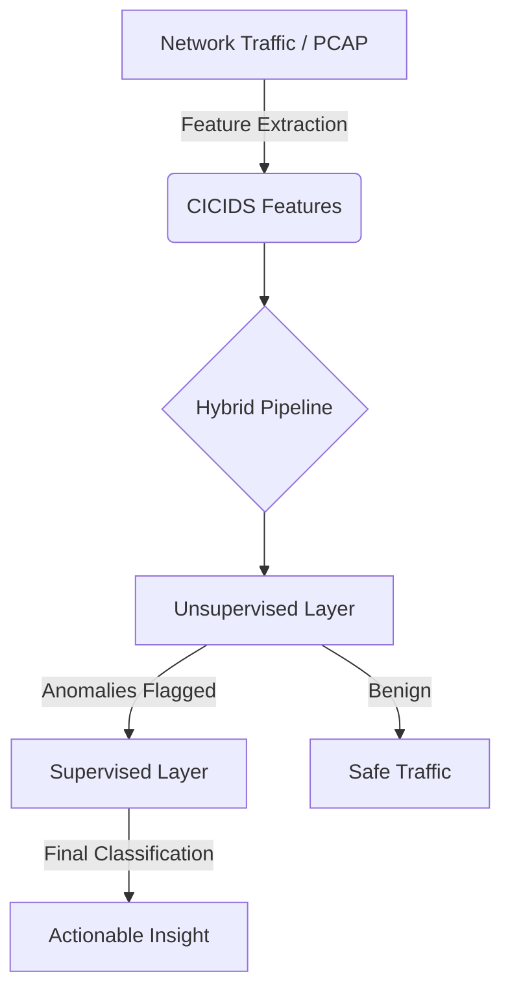

# 🛡️ Intrusion Tracker Backend - Project Documentation

Welcome to the **Intrusion Tracker Backend**, a high-performance network security monitoring system powered by FastAPI and a hierarchical machine learning pipeline. This system is designed to detect and classify network intrusions in real-time.

---

## 🏗️ System Architecture

The project follows a modular architecture designed for low-latency inference and high throughput.



### 🧠 Machine Learning Pipeline
The core of this project is a **Hierarchical Detection Strategy**:

1.  **Unsupervised Layer (The Flaggers)**:
    - **Autoencoder**: Reconstructs input data; high reconstruction error indicates an anomaly.
    - **Isolation Forest**: Detects anomalies by isolating observations in feature space.
    - *Logic*: If either model flags the traffic, it proceeds to the next stage.

2.  **Supervised Layer (The Judges)**:
    - **LightGBM (Final Veto)**: A gradient boosting framework that provides the final classification.
    - **FFNN (Feed-Forward Neural Network)**: Deep learning model for multi-class classification.
    - **XGBoost & Logistic Regression**: Additional models used for ensemble verification and comparison.

---

## 📂 Project Structure

| File / Directory | Description |
| :--- | :--- |
| `router.py` | Main FastAPI application, defines HTTP routes and WebSocket logic. |
| `predict.py` | Model loading (PyTorch, Joblib) and inference logic. |
| `utils.py` | Data loading (Polars), scaling (MinMax/Standard), and preprocessing. |
| `pcap_to_cicids.py` | Logic to convert raw PCAP files into 78-feature CICIDS datasets. |
| `stats.py` | Evaluation script to generate confusion matrices and performance reports. |
| `cors.py` | Middleware configuration for secure cross-origin requests. |
| `models/` | Serialized ML models (`.pt`, `.pth`, `.joblib`, `.npy`). |
| `scalers/` | Transformation models for data normalization (PCA, Scalers). |
| `dockerfile` | Containerization configuration. |

---

## 🚀 API Reference

### 🔓 Public Endpoints

#### Get API Information
`GET /intrusiondetection/api_name`
- **Response**: `{"name": "Intrusion Detection API", "version": "1.0.0"}`

#### Health Check
`GET /intrusiondetection/health`
- **Response**: `{"status": "healthy"}`

---

### 🔒 Protected Endpoints (Requires Bearer Token)

#### 🛡️ Hybrid Detection (Recommended)
`POST /intrusiondetection/predict/hybrid`
Uses the hierarchical pipeline: **Anomaly detection (Unsupervised) -> Classification (Supervised)**.
- **Logic**: If the Autoencoder or Isolation Forest flags the flow, the Supervised models (LightGBM, FFNN, etc.) are invoked. LightGBM provides the final "Veto" to determine if it is truly an attack.

#### 📍 Prediction By Index
`POST /intrusiondetection/predict/hybrid_by_index`
Used for testing existing samples from the `unscaled_test.parquet` dataset.
- **Request Body**:
  ```json
  {
    "index": 17502
  }
  ```

#### ⚡ Direct Model Endpoints
- `POST /predict/logreg`
- `POST /predict/lightgbm`
- `POST /predict/ffnn`
- `POST /predict/autoencoder`
- `POST /predict/isolationForest`
- `POST /predict/xgboost`

---

### 🔄 WebSocket Streaming
`WS /intrusiondetection/ws/stream`
Streams the dataset in batches of 100 rows with real-time statistics.

**Initialization Message**:
After connecting, send the following JSON:
```json
{
  "command": "start",
  "token": "your_secure_token_here",
  "start_at": 0
}
```

---

## 🧠 Technical Deep Dive: The LGBM Veto
In the hybrid pipeline, we prioritize reducing **False Positives**.
1. **Detection**: Unsupervised models are highly sensitive to anything "unusual".
2. **Verification**: If an anomaly is detected, LightGBM (trained on labeled data) acts as the final judge. If LightGBM classifies the flow as `0` (Benign), the "Attack Detected" status is overturned.


---

## 🛠️ Setup & Installation

### Environment Variables
Create a `.env` file with the following keys:
```env
TOKEN=your_secure_token
PATH_LIGHTGBM=models/multiclass_lightgbm.joblib
PATH_XGBOOST=models/multiclass_xgboost.joblib
PATH_PCA=scalers/incrementail_pca_model.joblib
PATH_STANDARD=scalers/standardscaler.joblib
PATH_MINMAX=scalers/minmaxscaler.joblib
```

### Running Locally
```bash
# Install dependencies
pip install -r requirements.txt

# Start the server
python router.py
```

### Running with Docker
```bash
docker-compose up --build
```

---

## 📊 Evaluation & Metrics
The `stats.py` script allows you to evaluate the entire pipeline against the test dataset. It generates:
- **`confusion_matrix.png`**: Visual representation of model accuracy across classes.
- **`classification_report.png`**: Heatmap of Precision, Recall, and F1-score.
- **`confusion_matrix.txt`**: Detailed textual metrics.

---

## 🛡️ Security
- **Authentication**: All sensitive endpoints are protected via `HTTPBearer` tokens.
- **CORS**: Restricted to specific domains defined in `cors.py`.

---
*Generated by Antigravity AI*
